# Dr. Efrat Dener

**Plant ecologist · Quantitative & computational researcher**
Postdoctoral researcher, Ben-Gurion University of the Negev

I study **seed dispersal, plant trait variation, and community ecology** across spatial scales, using field experiments, statistical modelling, and simulation. My work pairs ecological theory with computational methods — hierarchical variance models, agent-based simulation, image analysis, and interactive data tools.

📄 **[Download CV (PDF)](https://github.com/efratde/efratde/raw/main/CV_Dener.pdf)** &nbsp;·&nbsp;
🔬 [ORCID 0000-0002-6185-7046](https://orcid.org/0000-0002-6185-7046) &nbsp;·&nbsp;
🎓 [Google Scholar](https://scholar.google.com/citations?user=oyDO1XoAAAAJ)

---

## 🔬 Live demos — click any image to open

**A breadth-of-stacks showcase** — one researcher working across R/Shiny, Python, JavaScript/WebGL and NetLogo, spanning spatial statistics, hierarchical variance models, in-browser image analysis, agent-based simulation, interactive 3D interfaces, and reproducible technical reporting. Every demo runs **live in your browser**.

> 🧪 **No real or protected data is exposed.** Demos built on my research studies ship demonstration data fabricated to mirror the real data's structure — no real measurements, coordinates, or localities. Theory, modelling, and engineering demos run on simulated, fictional, or public data.

<table>
<tr>
<td width="50%" valign="top">
<a href="https://n248wr-efrat-dener.shinyapps.io/wildass-dashboard/">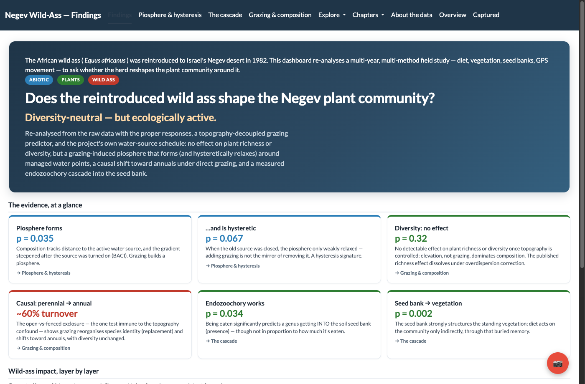</a>
<h3>🦓 Negev wild-ass study</h3>

A multi-method field study re-analysed end to end — fecal-DNA diet, GPS movement, vegetation, seed banks, and piosphere dynamics — built around one question: <em>does the reintroduced wild ass reshape the plant community?</em>

<b><a href="https://n248wr-efrat-dener.shinyapps.io/wildass-dashboard/">▶ Live demo</a></b>
</td>
<td width="50%" valign="top">
<a href="https://ig58km-efrat-dener.shinyapps.io/hierarchical-variance/">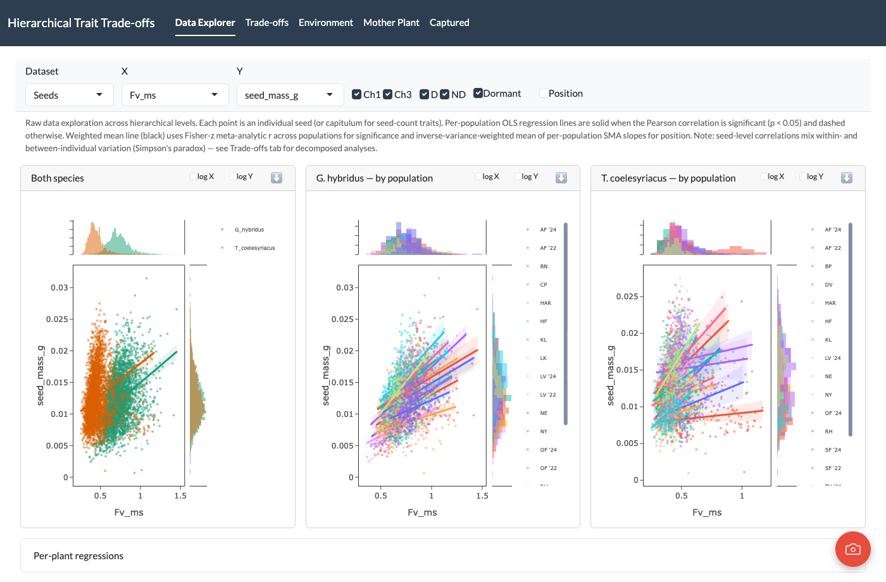</a>
<h3>📊 Hierarchical variance dashboard</h3>

Multi-scale variance partitioning of dispersal traits — SMA trade-offs, environmental drivers, and mother-plant effects in <em>Geropogon</em> &amp; <em>Tragopogon</em>, with per-population regressions and Simpson's-paradox-aware decomposition.

<b><a href="https://ig58km-efrat-dener.shinyapps.io/hierarchical-variance/">▶ Live demo</a></b> &nbsp;·&nbsp; <a href="https://github.com/efratde/hierarchical-variance-dashboard">Code</a>
</td>
</tr>
<tr>
<td width="50%" valign="top">
<a href="https://efratde.github.io/interactive-ecology-models/">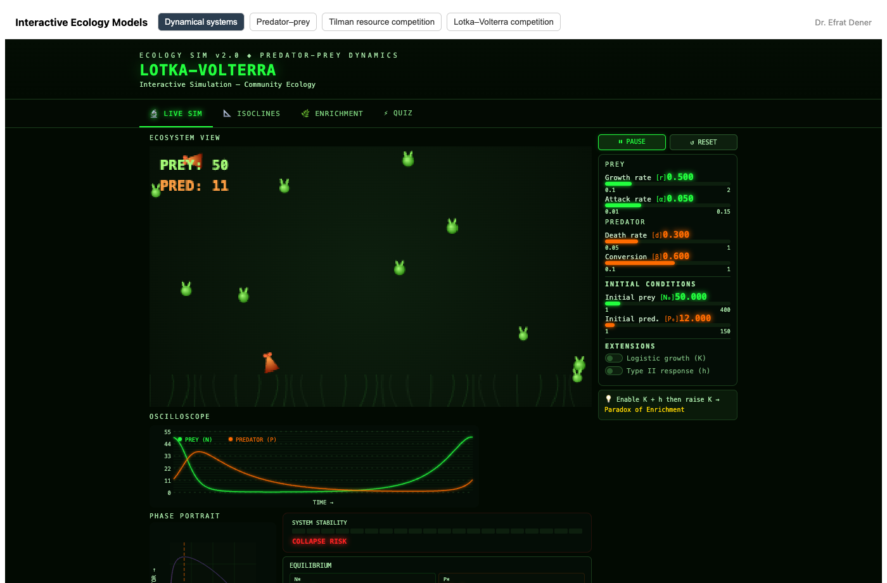</a>
<h3>🌱 Interactive ecology models</h3>

Browser simulations of classic theory — Lotka–Volterra predator–prey, Tilman resource competition, coexistence, and dynamical systems — with live animation, phase portraits, and built-in quizzes.

<b><a href="https://efratde.github.io/interactive-ecology-models/">▶ Live demo</a></b> &nbsp;·&nbsp; <a href="https://github.com/efratde/interactive-ecology-models">Code</a>
</td>
<td width="50%" valign="top">
<a href="https://n248wr-efrat-dener.shinyapps.io/simpson-paradox/">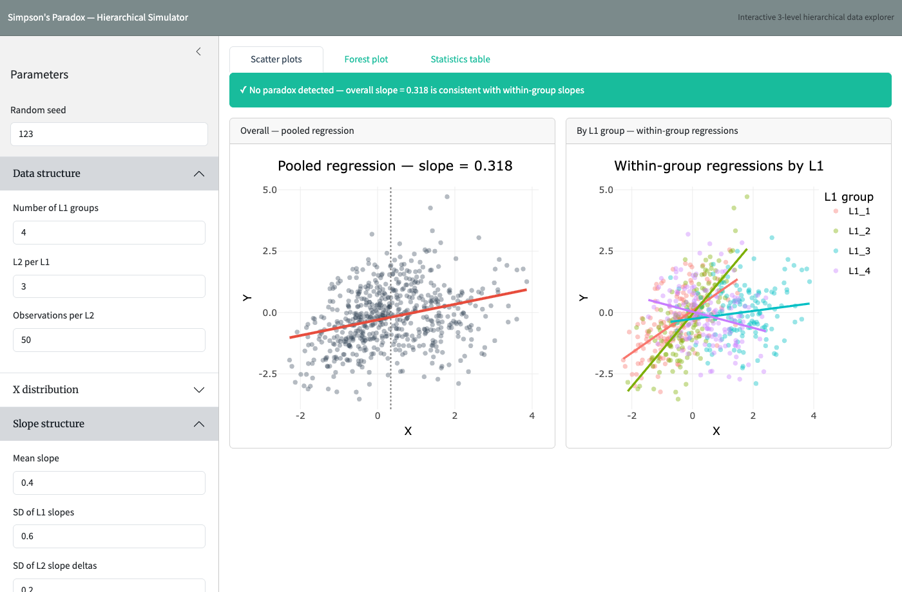</a>
<h3>🔀 Simpson's Paradox simulator</h3>

Simulate 3-level hierarchical data and watch the pooled slope flip direction relative to within-group slopes. Adjustable hierarchy, slope–mean correlation, and noise; live forest plots and a paradox detector.

<b><a href="https://n248wr-efrat-dener.shinyapps.io/simpson-paradox/">▶ Live demo</a></b> &nbsp;·&nbsp; <a href="https://github.com/efratde/simpson-paradox">Code</a>
</td>
</tr>
<tr>
<td width="50%" valign="top">
<a href="https://n248wr-efrat-dener.shinyapps.io/voc-pollinator/">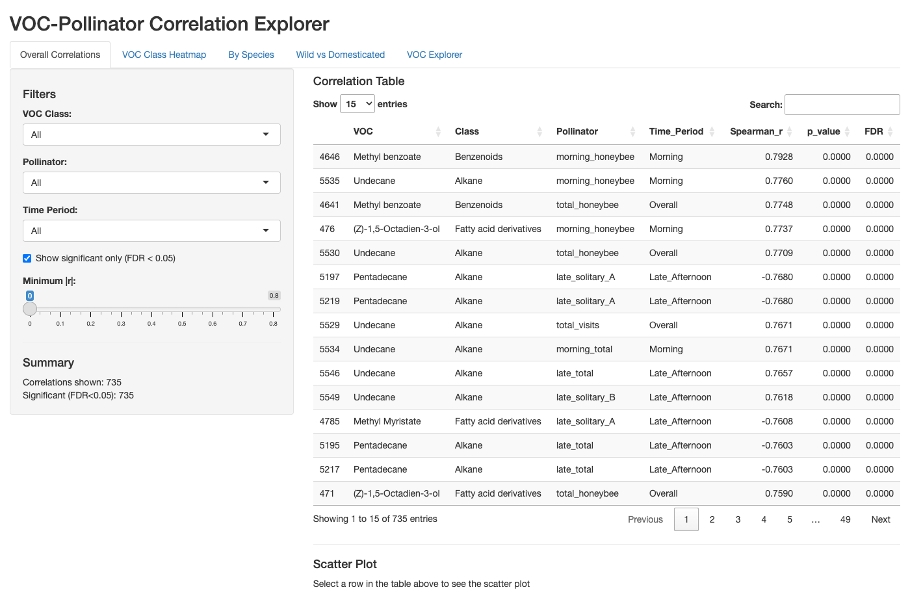</a>
<h3>🌸 VOC × Pollinator explorer</h3>

Volatile-compound profiles correlated with pollinator visitation in wild and domesticated <em>Carthamus</em> — FDR-controlled correlation tables, class heatmaps, and per-species comparisons.

<b><a href="https://n248wr-efrat-dener.shinyapps.io/voc-pollinator/">▶ Live demo</a></b> &nbsp;·&nbsp; <a href="https://github.com/efratde/voc-pollinator">Code</a>
</td>
<td width="50%" valign="top">
<a href="https://n248wr-efrat-dener.shinyapps.io/wildass-diet/">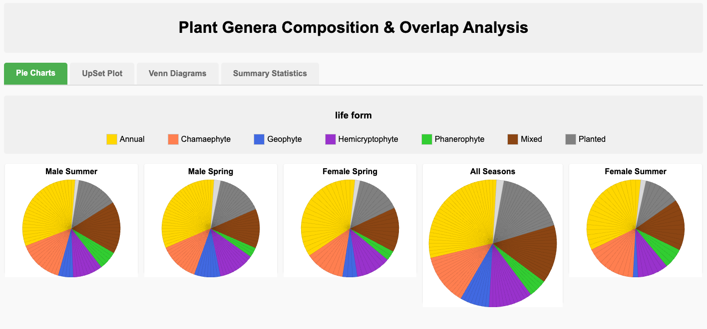</a>
<h3>🌿 Wild-ass diet — metabarcoding</h3>

Diet characterised via fecal DNA metabarcoding: Shannon diversity, genus composition, relative-frequency-of-occurrence rankings, beta distance-decay, and an interactive genus explorer.

<b><a href="https://n248wr-efrat-dener.shinyapps.io/wildass-diet/">▶ Live demo</a></b> &nbsp;·&nbsp; <a href="https://github.com/efratde/wildass-diet">Code</a>
</td>
</tr>
<tr>
<td width="50%" valign="top">
<a href="https://n248wr-efrat-dener.shinyapps.io/dispersal-trait-variance/">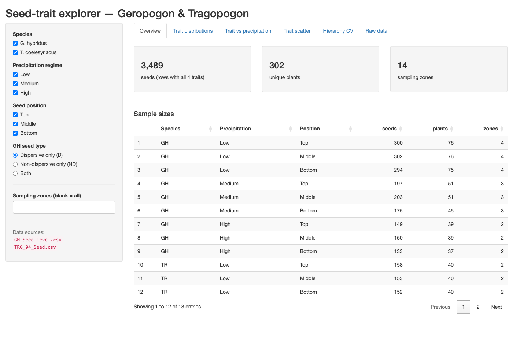</a>
<h3>🪶 Dispersal-trait field study</h3>

Seed-morphology variance across precipitation gradients and capitulum positions — trait distributions, scatter relationships, and a coefficient-of-variation breakdown by hierarchical level.

<b><a href="https://n248wr-efrat-dener.shinyapps.io/dispersal-trait-variance/">▶ Live demo</a></b> &nbsp;·&nbsp; <a href="https://github.com/efratde/hierarchical-variance-dashboard">Code</a>
</td>
<td width="50%" valign="top">

<h3>🔬 Pappus morphology analyzer</h3>

Upload a seed photo and segment the pappus entirely in-browser — Otsu/manual thresholding, morphology cleanup, and morphometrics (area, perimeter, circularity, Feret diameter, solidity) with CSV export.

<b><a href="https://efratde.github.io/image-morphometrics/pappus-analyzer.html">▶ Live demo</a></b> &nbsp;·&nbsp; <a href="https://github.com/efratde/image-morphometrics">Code</a>
</td>
</tr>
<tr>
<td width="50%" valign="top">
<a href="https://ig58km-efrat-dener.shinyapps.io/root-alignment/">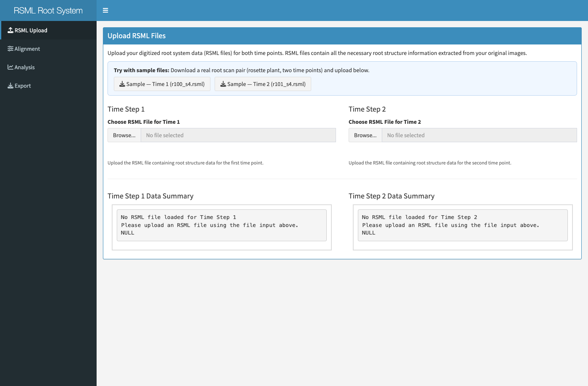</a>
<h3>🌾 Root growth alignment tool</h3>

Align RSML root-system scans across two time points — geometric registration, per-root correspondence mapping, and growth quantification. Sample RSML files are included so you can try it immediately.

<b><a href="https://ig58km-efrat-dener.shinyapps.io/root-alignment/">▶ Live demo</a></b> &nbsp;·&nbsp; <a href="https://github.com/efratde/root-alignment">Code</a>
</td>
<td width="50%" valign="top">
<a href="https://www.netlogoweb.org/launch#https://raw.githubusercontent.com/efratde/dispersal-kernel-model/main/model/dispersal-kernel-model.nlogo">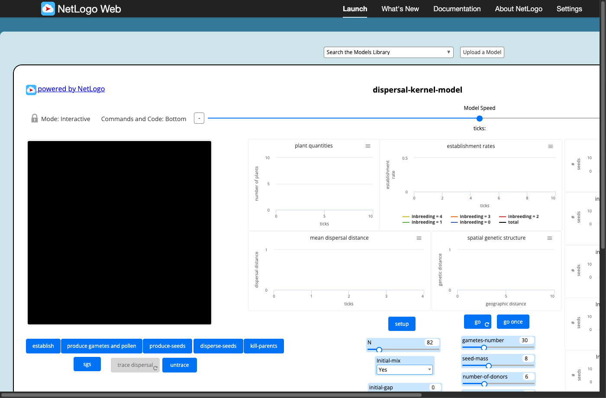</a>
<h3>🧬 Dispersal-kernel evolution model</h3>

NetLogo agent-based model of dispersal-kernel evolution — a spatially explicit simulation of seed and pollen dispersal, gamete formation, establishment, and the build-up of spatial genetic structure and inbreeding across a heterogeneous landscape. Runs in the browser via NetLogo Web.

<b><a href="https://www.netlogoweb.org/launch#https://raw.githubusercontent.com/efratde/dispersal-kernel-model/main/model/dispersal-kernel-model.nlogo">▶ Run in browser</a></b> &nbsp;·&nbsp; <a href="https://github.com/efratde/dispersal-kernel-model">Code</a>
</td>
</tr>
<tr>
<td width="50%" valign="top">
<a href="https://efratde.github.io/smart-home-demo/">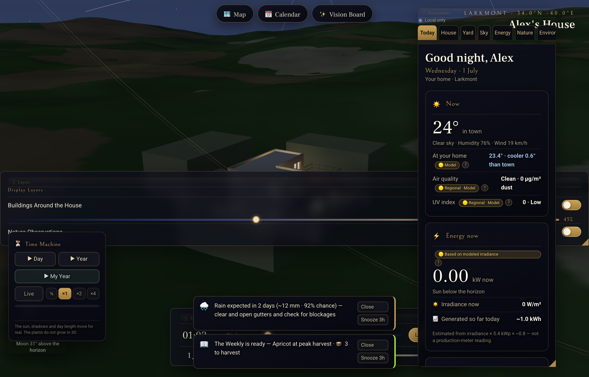</a>
<h3>🏡 3D smart-home dashboard</h3>

An interactive 3D "living home" — a WebGL house model wired to weather, solar-energy, garden, and night-sky panels, with a time-machine scrubber across days and years. Three.js with a from-scratch sun-position / astronomy engine; runs entirely client-side. Demo data for a fictional household.

<b><a href="https://efratde.github.io/smart-home-demo/">▶ Live demo</a></b> &nbsp;·&nbsp; <a href="https://github.com/efratde/smart-home-demo">Code</a>
</td>
<td width="50%" valign="top">

<h3>🎫 Personalized event digest</h3>

An event-digest engine — aggregates public performance listings, ranks them by learned preferences, and renders a newspaper-style daily brief with category filters, search, and a saved shortlist. Python data pipeline with a static HTML/CSS front end.

<b><a href="https://event-digest.pages.dev/">▶ Live demo</a></b> &nbsp;·&nbsp; <a href="https://github.com/efratde/event-digest">Code</a>
</td>
</tr>
<tr>
<td width="50%" valign="top">
<a href="https://efratde.github.io/industrial-dispersion/industrial_dispersion_assessment.html">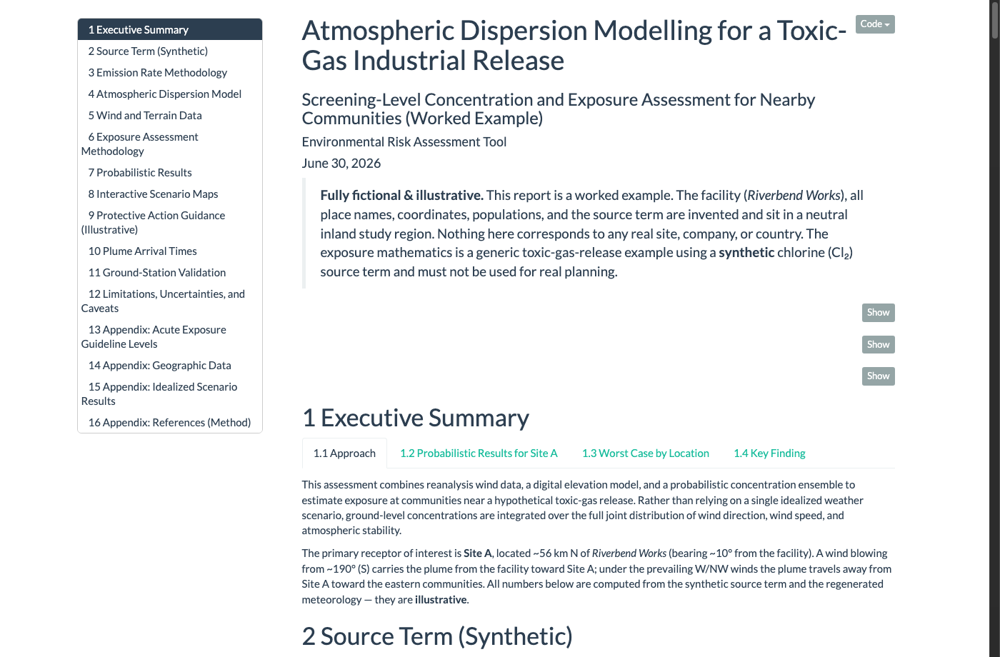</a>
<h3>☁️ Atmospheric dispersion report</h3>

A reproducible R Markdown worked example — Gaussian-plume dispersion of a toxic-gas (chlorine) release with a probabilistic concentration ensemble over reanalysis winds, AEGL/ERPG exposure thresholds, plume-arrival times, and interactive scenario maps. Fully fictional facility and study region.

<b><a href="https://efratde.github.io/industrial-dispersion/industrial_dispersion_assessment.html">▶ Open report</a></b> &nbsp;·&nbsp; <a href="https://github.com/efratde/industrial-dispersion">Code</a>
</td>
<td width="50%" valign="top">
<a href="https://efratde.github.io/dispersion-sim/">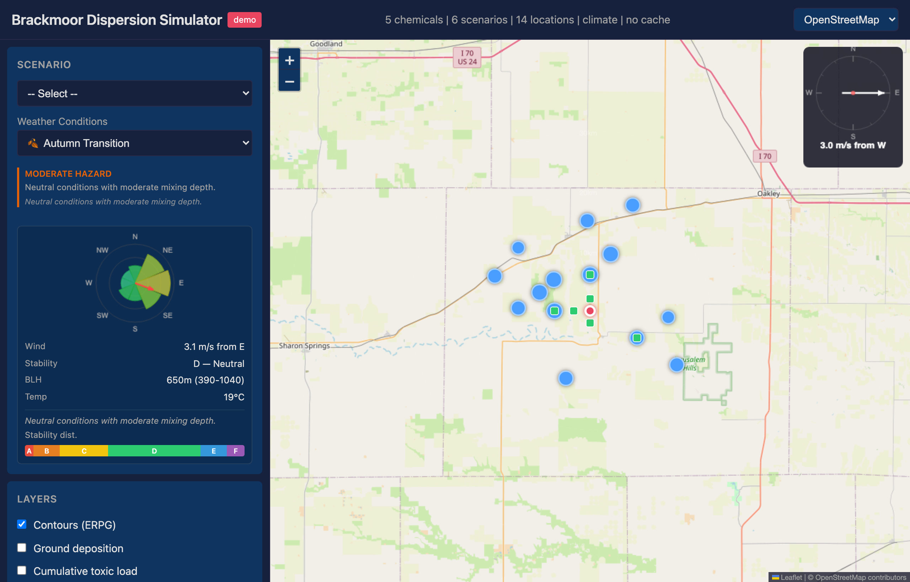</a>
<h3>🌫️ Live dispersion simulator</h3>

The interactive companion to the report on the left — pick a chemical-release scenario and a weather regime and a Gaussian-plume concentration field is computed <em>live in the browser</em>: ERPG hazard contours via marching-squares, an animated travelling plume, a wind rose, per-settlement exposure, and a draft emergency-response protocol. Vanilla JS + Leaflet + D3, no server. Fictional facility, towns, and weather.

<b><a href="https://efratde.github.io/dispersion-sim/">▶ Live demo</a></b> &nbsp;·&nbsp; <a href="https://github.com/efratde/dispersion-sim">Code</a>
</td>
</tr>
<tr>
<td width="50%" valign="top">
<a href="https://www.netlogoweb.org/launch#https://raw.githubusercontent.com/efratde/habitat-fragmentation-model/main/model/habitat-fragmentation-dispersal-model-web.nlogo">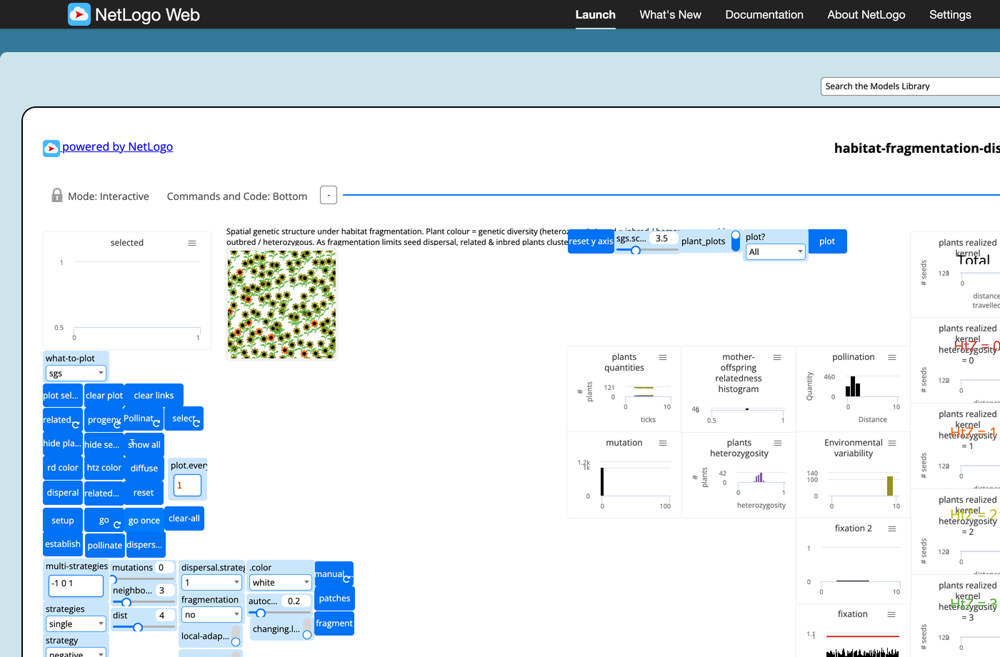</a>
<h3>🧩 Habitat-fragmentation model</h3>

A NetLogo agent-based model of plant dispersal under habitat fragmentation — seed and pollen disperse across a fragmenting landscape while relatedness, inbreeding, and spatial genetic structure build up, showing how fragmentation limits dispersal and reshapes population genetics. Runs in the browser via NetLogo Web.

<b><a href="https://www.netlogoweb.org/launch#https://raw.githubusercontent.com/efratde/habitat-fragmentation-model/main/model/habitat-fragmentation-dispersal-model-web.nlogo">▶ Run in browser</a></b> &nbsp;·&nbsp; <a href="https://github.com/efratde/habitat-fragmentation-model">Code</a>
</td>
<td width="50%" valign="top">
</td>
</tr>
</table>

---

## 📦 Code repositories

| Repository | What it is |
|---|---|
| [hierarchical-variance-dashboard](https://github.com/efratde/hierarchical-variance-dashboard) | Multi-scale variance partitioning of dispersal traits (R / Shiny) |
| [interactive-ecology-models](https://github.com/efratde/interactive-ecology-models) | Browser simulations of classic ecological theory (JS) |
| [dispersal-kernel-model](https://github.com/efratde/dispersal-kernel-model) | NetLogo ABM — dispersal-kernel evolution, seed/pollen dispersal & spatial genetic structure |
| [image-morphometrics](https://github.com/efratde/image-morphometrics) | Root architecture from RSML + seed morphology from images (Python / JS) |
| [smart-home-demo](https://github.com/efratde/smart-home-demo) | Interactive 3D "living home" dashboard — Three.js + a from-scratch astronomy engine (JS / WebGL) |
| [industrial-dispersion](https://github.com/efratde/industrial-dispersion) | Reproducible atmospheric-dispersion worked example — Gaussian plume + exposure thresholds (R / R Markdown) |
| [dispersion-sim](https://github.com/efratde/dispersion-sim) | Interactive in-browser Gaussian-plume dispersion simulator — ERPG contours, animated plume, per-settlement exposure (JS / Leaflet / D3) |
| [habitat-fragmentation-model](https://github.com/efratde/habitat-fragmentation-model) | NetLogo ABM — plant dispersal & spatial genetic structure under habitat fragmentation |
| [event-digest](https://github.com/efratde/event-digest) | Personalized event-digest engine — Python pipeline + static web front end |
| [simpson-paradox](https://github.com/efratde/simpson-paradox) · [voc-pollinator](https://github.com/efratde/voc-pollinator) · [wildass-diet](https://github.com/efratde/wildass-diet) · [root-alignment](https://github.com/efratde/root-alignment) | Standalone analysis apps (R / Shiny) |

---

## 📚 Selected publications

Full, up-to-date list on [ORCID](https://orcid.org/0000-0002-6185-7046) and [Google Scholar](https://scholar.google.com/citations?user=oyDO1XoAAAAJ).

**2026**
- Dietary insights into ecological integration and impact on vegetation of a reintroduced large herbivore in a hyper-arid ecosystem. *Global Ecology and Conservation.* [doi](https://doi.org/10.1016/j.gecco.2026.e04215)
- Multi-level variation in dispersal traits along a precipitation gradient. *Global Ecology and Conservation.* [doi](https://doi.org/10.1016/j.gecco.2026.e04246)
- Tree–microbe–soil interactions affecting soil organic carbon fractions in Mediterranean forest soils. *EGUsphere* (preprint). [doi](https://doi.org/10.5194/egusphere-2026-2099)

**2025**
- Plant fitness is shaped by cascading effects of aridity and drought on floral traits and pollination services. *Agriculture, Ecosystems & Environment.* [doi](https://doi.org/10.1016/j.agee.2025.109855)

**2024**
- Stress induces trait variability across multiple spatial scales in the arid annual plant *Anastatica hierochuntica*. *Plants.* [doi](https://doi.org/10.3390/plants13020256)

**2022**
- Limits to the evolution of dispersal kernels under rapid fragmentation. *Journal of The Royal Society Interface.* [doi](https://doi.org/10.1098/rsif.2021.0696)
- A hidden mechanism of forest loss under climate change: the role of drought in eliminating forest regeneration at the edge of its distribution. *Forest Ecology and Management.* [doi](https://doi.org/10.1016/j.foreco.2021.119966)
- Bedrock may dictate the distribution of the fire salamander in the southern border of its global range. *Israel Journal of Ecology and Evolution.* [doi](https://doi.org/10.1163/22244662-bja10041)

**2021**
- Direct and indirect effects of fragmentation on seed dispersal traits in a fragmented agricultural landscape. *Agriculture, Ecosystems & Environment.* [doi](https://doi.org/10.1016/j.agee.2020.107273)
- Phylogeny and abiotic conditions shape the diel floral emission patterns of desert Brassicaceae species. *Plant, Cell & Environment.* [doi](https://doi.org/10.1111/pce.14045)

**2020**
- Effect of habitat fragmentation on seed dispersal ability of a wind-dispersed annual in an agroecosystem. *Agriculture, Ecosystems & Environment.* [doi](https://doi.org/10.1016/j.agee.2020.107138)
- The effect of pollen source on seed traits and dispersability in the heterocarpic annual *Crepis sancta*. *Journal of Plant Ecology.* [doi](https://doi.org/10.1093/jpe/rtaa105)

**2016**
- Pea plants show risk sensitivity. *Current Biology.* [doi](https://doi.org/10.1016/j.cub.2016.05.008)

---

*Plant ecology · Dispersal biology · Quantitative & hierarchical methods · [ORCID](https://orcid.org/0000-0002-6185-7046) · [Google Scholar](https://scholar.google.com/citations?user=oyDO1XoAAAAJ)*
